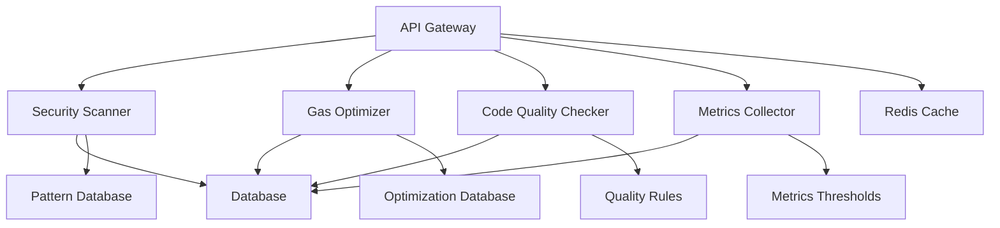

# System Architecture

## Overview

The Smart Contract Analysis system is built as a distributed, scalable architecture with the following key components:

## Components

### 1. API Gateway
- FastAPI-based REST API
- Rate limiting and authentication
- Request validation using Pydantic
- Async request handling

### 2. Analysis Components
- Security Scanner: Identifies vulnerabilities
- Gas Optimizer: Suggests optimizations
- Code Quality Checker: Enforces standards
- Metrics Collector: Gathers statistics

### 3. Data Storage
- PostgreSQL for persistent storage
- Redis for caching and rate limiting
- File-based pattern databases

## Communication Flow

1. Client sends request to API Gateway
2. Request is validated and authenticated
3. Analysis components process in parallel
4. Results are aggregated and returned
5. Metrics are stored for historical analysis

## Security

- API key authentication
- Rate limiting per client
- Input validation
- Secure data storage
- Audit logging

## Scalability

- Horizontal scaling of components
- Cache layer for performance
- Async processing for concurrency
- Database optimization

## Monitoring

- Prometheus metrics
- Grafana dashboards
- Error tracking
- Performance monitoring

## Deployment

- Docker containerization
- Kubernetes orchestration
- Cloud-native design
- Infrastructure as Code
