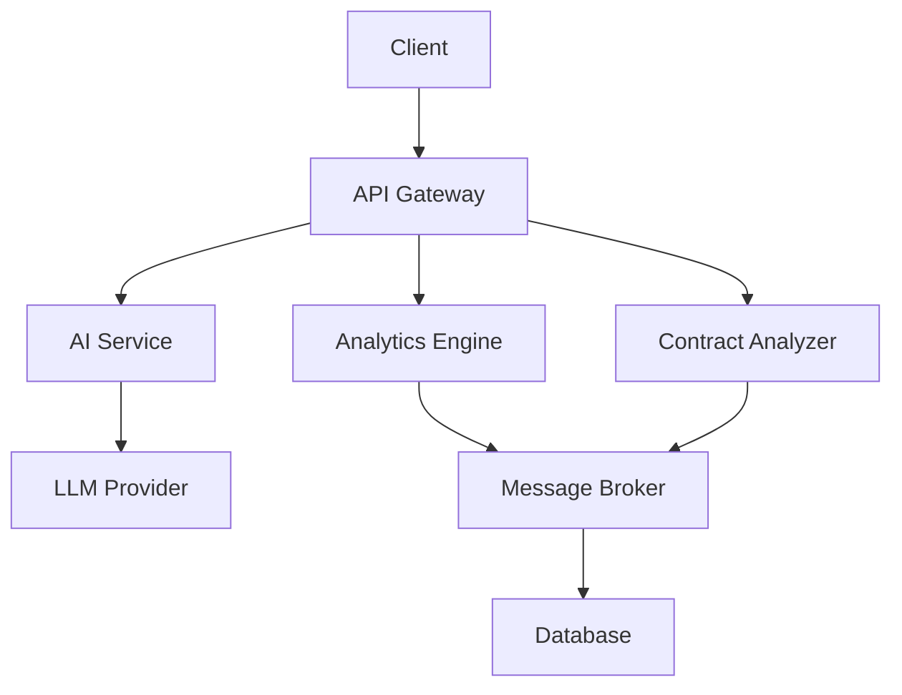

# Architecture


Sand Framework uses a microservices architecture for scalability and maintainability.


## System Components



* **API Gateway**: FastAPI-based REST API
* **AI Service**: LLM integration for development assistance
* **Analytics Engine**: Real-time data processing
* **Contract Analyzer**: Smart contract security and optimization



* **Message Broker**: RabbitMQ for service communication
* **Database**: PostgreSQL for persistent storage
* **Cache**: Redis for performance optimization
* **Load Balancer**: For horizontal scaling



## System Architecture



## Data Flow

1. **Client Requests**
   * REST API calls
   * WebSocket connections
   * Discord commands

2. **Service Communication**
   * Event-driven architecture
   * Message queues for async operations
   * Service discovery

3. **Data Storage**
   * PostgreSQL for structured data
   * Redis for caching
   * File system for temporary storage

## Scalability


The system is designed to scale horizontally for increased load.


* **Service Replication**: Multiple instances of each service
* **Load Distribution**: Round-robin and least-connections
* **Data Partitioning**: Sharding for large datasets
* **Caching Strategy**: Multi-level caching

## Security Architecture

* **API Security**: JWT authentication
* **Service Mesh**: Internal service authentication
* **Data Encryption**: At rest and in transit
* **Rate Limiting**: Prevent abuse

## Deployment

The system can be deployed using:

```bash
# Development
docker-compose up -d

# Production
kubectl apply -f k8s/
```


Ensure proper security measures before production deployment.

