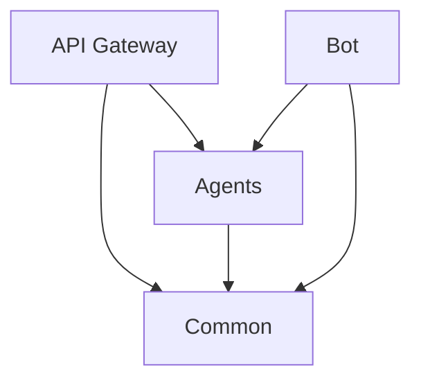

# Project Structure


Understanding the project structure helps you navigate and contribute to Sand Framework effectively.


## Directory Layout

```
sand-framework/
├── api_gateway/          # FastAPI application
│   ├── routes/          # API endpoints
│   ├── middleware/      # Request middleware
│   └── core/           # Core configurations
│
├── agents/              # AI and Analytics agents
│   ├── ai_service/     # AI development assistant
│   ├── analytics/      # Price and sentiment analysis
│   └── contract/       # Smart contract analysis
│
├── bot/                # Discord bot integration
│   ├── cogs/          # Bot commands
│   └── handlers/      # Event handlers
│
├── common/             # Shared utilities
│   ├── database/      # Database models
│   ├── cache/         # Caching utilities
│   └── security/      # Security utilities
│
├── tests/             # Test suite
│   ├── unit/         # Unit tests
│   └── integration/  # Integration tests
│
├── docs/              # Documentation
├── scripts/           # Utility scripts
└── docker/           # Docker configurations
```

## Key Components



* `routes/` - API endpoint definitions
* `middleware/` - Request processing
* `core/` - Configuration and startup



* `ai_service/` - LLM integration
* `analytics/` - Data processing
* `contract/` - Code analysis



* `database/` - Data models
* `cache/` - Caching logic
* `security/` - Security utilities



## Configuration Files

```
├── .env.example        # Environment template
├── requirements.txt    # Python dependencies
├── docker-compose.yml  # Docker services
├── Dockerfile         # Container build
└── setup.py          # Package configuration
```

## Module Dependencies



## Adding New Features

1. Create new module:
```bash
sand-framework/
└── agents/
    └── new_feature/
        ├── __init__.py
        ├── service.py
        └── models.py
```

2. Update API routes:
```python
# api_gateway/routes/new_feature.py
from fastapi import APIRouter

router = APIRouter(prefix="/api/v1/new-feature")

@router.post("/")
async def handle_new_feature():
    pass
```

3. Add tests:
```python
# tests/unit/test_new_feature.py
def test_new_feature():
    pass
```

## Code Style

We follow these conventions:
* PEP 8 for Python code
* Black for code formatting
* Type hints for function signatures
* Docstrings for all public APIs


Use `pre-commit` hooks to maintain code quality:
```bash
pre-commit install
```

